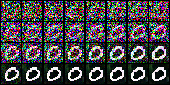
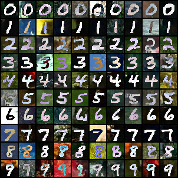

# Diffusion Model Digit Generation

Handwritten digit generation with diffusion model on MNIST-M dataset

Method: [Ho and Salimans 2022](https://arxiv.org/abs/2207.12598)

Results:

See problem 2 in [Report.pdf](./Report.pdf) and [Spec.pdf](Spec.pdf) for more details.
